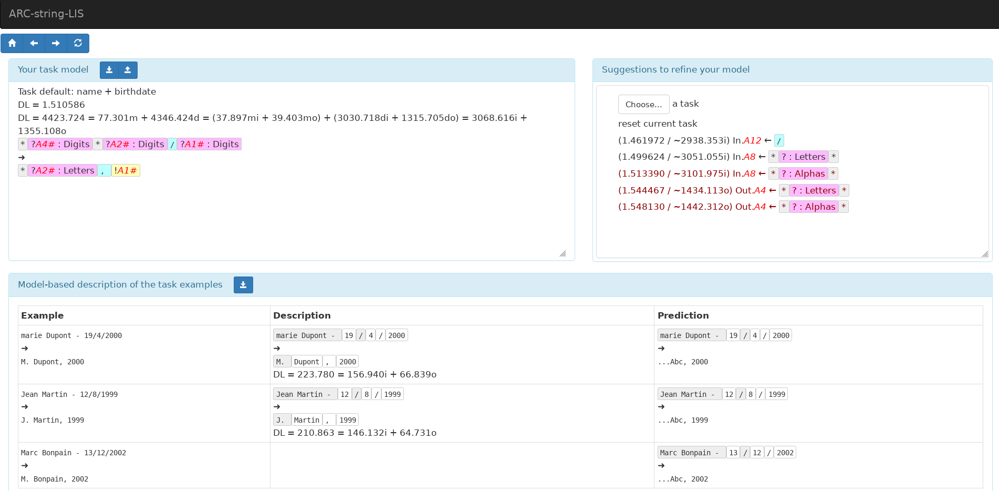

# MDL-based Machine Learning for Abstraction and Reasoning Tasks on Strings

Suppose that you have a spreadsheet with a number of columns (the inputs), and that you want to automatically fill additional columns (the outputs) as a function of the input columns. Instead of programming a formula or a program to do the job, you would prefer to provide a few examples, and have an AI system to synthesize a program matching your intention.

| input | output |
|-------|--------|
| marie Dupont - 19/4/2000 | M. Dupont, 2000 |
| Jean Martin - 12/8/1999 | J. Martin, 1999 |
| Marc Bonpain - 13/12/2002 |  ??? |
| ... | ??? |

A correct program could be `printf("%s. %s, %d", uppercase(substr(firstname,0,1)), lastname, year)`, where `firstname`, `lastname` and `year` are substrings of the input string, possibly extracted with regexps.

This is known as *program synthesis* or *programming by examples*, and this has been studied for already a long time. We can cite in particular the work of Gulwani, [*Automating string processing in spreadsheets using input-output examples*](https://dl.acm.org/doi/abs/10.1145/1925844.1926423), which has shown some success and has been integrated into Microsoft Excel.

A parallel can be made with the [Abstraction and Reasoning Corpus (ARC)](https://github.com/fchollet/ARC), where the objective is the same, to learn by examples how to generate an output from an input, except that inputs and outputs are colored grids. ARC has been introduced as a kind of IQ test for AI, and to foster AI research towards broad generalization capabilities.

I started to develop an [approach to ARC](https://github.com/sebferre/ARC-MDL) based on object-centered models for grids, and the [Minimum Description Length (MDL) principle](https://en.wikipedia.org/wiki/Minimum_description_length). The ARC-MDL-strings project aims at evaluating the genericity of the approach by transposing it from grids to strings. Another motivation is that it also has obvious practical applications for data wrangling.

## Installation Instructions

The tool is developed in [OCaml](https://ocaml.org), and compiled to Javascript with the [js_of_ocaml](https://ocsigen.org/js_of_ocaml/latest/manual/overview) tool. It is strongly recommended to use the [opam](https://opam.ocaml.org/) tool to manage OCaml dependencies.

The dependencies are:
- OCaml compilers version 4.11.1+
- opam packages: yojson, ppx_deriving_yojson, js_of_ocaml, js_of_ocaml-lwt, js_of_ocaml-ppx
- personal libraries: [ocaml-lib](https://bitbucket.org/sebferre/ocaml-lib/src/), [fablis](https://github.com/sebferre/fablis)

When all dependencies are installed, the tool can be compiled by moving in the `src` directory, and executing the command `make lis`. This generates a `src/html/script.js` file that contains all the code of a web application, along with other files in the `src/html` directory (HTML, CSS, ...).

## User Interface

To run the tool, simply open `src/html/index.html` file in your
browser (Firefox or Chrome recommended). Here is a screenshot of the tool UI.



In short, here are the main UI components:
- *top left*: the model under construction, in the form `INPUT-PATTERN => OUTPUT-TEMPLATE`, along with a number of description lengths (DL);
- *top right*: a list of suggestions for refining the model, from the most compressive one to the less compressive one. Suggestions in red are not compressive but they are useful for testing. The button `Choose` enables to load a new task, which resets the model to the initial empty model;
- *bottom*: examples, one per row, with contents dispatched into three columns:
  - **Example**: the input and the expected output
  - **Description**: the input-output pair, as seen by the current model. Void for test examples.
  - **Prediction**: the input as seen by the input pattern, and the predicted output according to the output template, to be compared with the expected output in the left column.


## JSON schema for Tasks

The tool accepts task descriptions, i.e. input-output pairs for training and for test, along the following JSON schema.

```
{"train": [
   {"input": [A1, B1], "output": [C1, D1]},
   {"input": [A2, B2], "output": [C2, D2]},
   ...],
 "test": [
   {"input": [A3, B3], "output": [C3, D3]},
   ...]
}
```

A1, B1, A2... must be strings where A, B, C... denote columns, and indices 1, 2... denote rows/examples. Singleton lists like `["foo"]` can be flatten as string `"foo"`.

## Credits

Author: [Sébastien Ferré](http://people.irisa.fr/Sebastien.Ferre/)

Affiliation: Univ. Rennes 1, team [LACODAM](http://team.inria.fr/lacodam/) at IRISA

Copyright © 2022 Sébastien Ferré, IRISA, Université de Rennes 1, France

Licence: GPLv3
